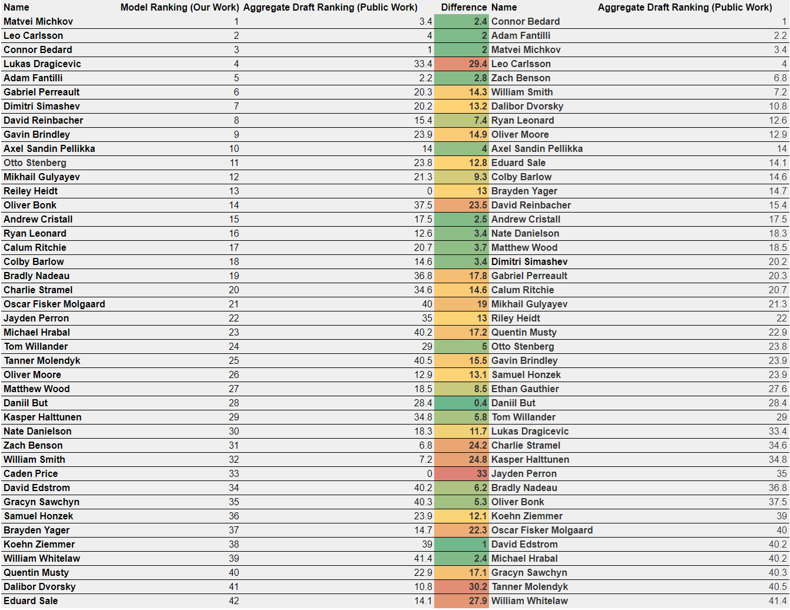
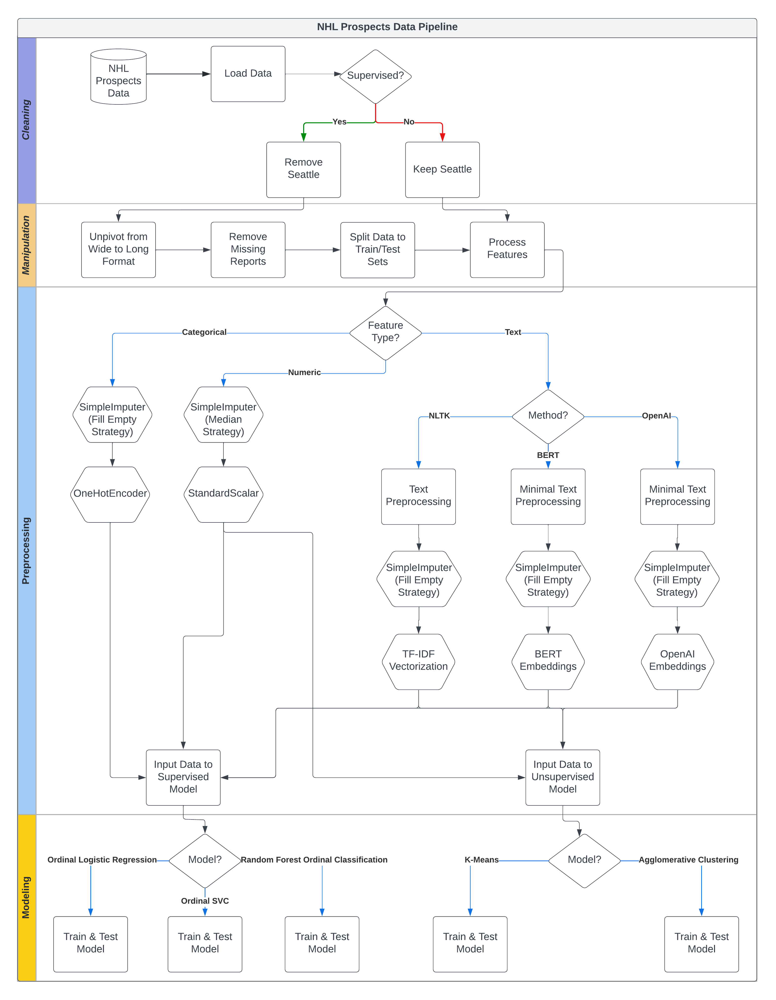

# nhl-draft-predictions

## Description

One of the most exciting events in the National Hockey League's (NHL) calendar is the annual draft where teams pick and choose hockey prospects in the hopes of selecting the next star. Attempts at predicting the pick order use number-based quantitative features from player statistics or qualitative features such as the player’s perceived strengths and weaknesses as well as the compatibility with the respective teams. What sets this project apart is the use of text-based Natural Language Processing (NLP) techniques to extract each player's qualities from player scouting reports. Solving this problem reveals novel techniques to make draft predictions and describe players using word embeddings.

Read our report [here](https://deepnote.com/@nhl-draft-predictions/NHL-Draft-Predictions-09d8dc5c-d54b-4729-bd12-f4067dd931f4)!

## 2023 NHL Draft Predictions

A major motivation for taking up this project was to make our own draft predictions for the upcoming 2023 NHL Draft on June 28, 2023 (in 2 days!!). Our results below come from our best model: Random Forest Ordinal Classification using OpenAI embeddings on the reports only, without any other numerical or categorical features. We used all previous years’ data as the training set while the test set was 2023’s prospects. As we were only predicting for a single year’s class, the drafted ranking label predictions could be ranked by performing the `argsort()` method. For future work, we will have to consider `Year` to create actual rankings between players. The issue with making predictions in this project was that the predictions spanned prospects from multiple years. We are pleased to see the results as the top 5 players from aggregate draft ranking from public rankings (mostly) appear within our own model ranking. This reveals that a model architecture that uses word embeddings for draft predictions shows great potential, but our model is not world-changing *yet*.

## Data Pipeline

Both the supervised and unsupervised tasks go through three different data pipelines for text preprocessing: 

1. A basic text processing with NLTK where we remove player names, remove unnecessary whitespace, remove English stop words, remove domain-specific hockey words, and normalize the text with Porter stemmer. The reason for removing player names is to prevent classifying players with similar names which was revealed in our explorations with the unsupervised task. Note that we remove domain-specific hockey words such as locations of interest, nationalities, and etc. to prevent grouping of players from the same leagues. This then passes through a TF-IDF vectorizer layer. Of particular interest are the ngram_range parameter for including bi-grams (2 word sequences; e.g., machine learning) and tri-grams (e.g., graph neural networks), the min_df parameter for setting a lower bound for how frequent words should appear throughout the corpus, and the max_df parameter for setting an upper bound.
2. Minimal text processing with NLTK where we remove player names, remove unnecessary whitespace, and remove domain-specific hockey words. We employ an encoding transformation with a state-of-the-art large language model (LLM) from Hugging Face to obtain the so-called BERT embeddings.
3. Also, minimal text processing with NLTK where we remove player names, remove unnecessary whitespace, and remove domain-specific hockey words. This time we employ an extremely popular LLM, Chat-GPT, from OpenAI to obtain word embeddings.

The first technique establishes a baseline for the downstream analysis and model performance while the last two are recent developments in the NLP space. The other dataset features go through separate pipelines for standardization/normalization and one-hot encoding (for categorical features). Finally, the supervised model follows an ordinal regression model which is a sequence of binary classifiers (e.g., Random Forests) that follows a ranking rule for determining the draft order. The main unsupervised methods pass through KMeans clustering and a comparison between TSNE vs UMAP visualizations.

This can be seen in the flowchart visualization:

This project is for the University of Michigan's Master of Applied Data Science (MADS) Milestone II (SIADS 696) course for the 2023 Spring/Summer semester.
